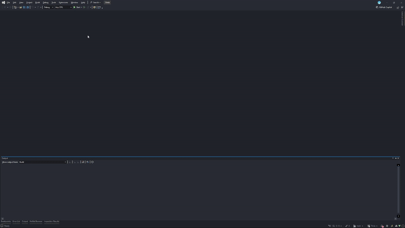

# Trivia Game 🎮



## Table of Contents
- [About The Project](#about-the-project-)
- [Key Features](#key-features-)
- [Installation](#installation)
- [Usage](#usage-)
- [License](#license-)
- [Acknowledgments](#acknowledgments-)

## About The Project 📚

This Trivia Game is a dynamic and engaging application that challenges players with a variety of trivia questions across multiple categories. The game is built with a focus on performance and user experience, utilizing a robust backend developed in C++ and a responsive frontend created with C#.

## Key Features ✨

- 🌐 <ins>**Multi-Category Questions:**</ins> Test your knowledge in various fields, including science, history, sports, and more.
- ⚡ <ins>**Real-Time Feedback:**</ins> Receive immediate feedback after each question, enhancing the learning experience.
- 🏆 <ins>**Scoring System:**</ins> Track player scores for competitive play.
- 🖥️ <ins>**Intuitive UI:**</ins> Clean and easy-to-navigate interface built with C#, ensuring a smooth user experience.
- 🚀 <ins>**Optimized Performance:**</ins> Fast processing of game logic and data handling with C++ backend, providing a seamless experience even with large question sets.

This project demonstrates the integration of powerful backend processing with a user-friendly frontend, showcasing the capabilities of C++ and C# in creating a full-featured application. Whether you're looking to test your trivia knowledge or develop your programming skills, this game offers a challenging and enjoyable experience.

### Installation

1. Clone the repository:
   ```bash
   git clone https://github.com/ItayShallev/Trivia.git
   ```
2. [Add any additional installation steps here, if necessary]

## Usage 🕹️

1. Run the Trivia server first.
2. Launch as many client instances as you wish.

[Add more detailed instructions if needed]

## License 📄

Distributed under the MIT License. See `LICENSE` file for more information.

## Acknowledgments 🙏

- [@GiladKupfer](https://github.com/GiladKupfer) - My partner for this project
- Magshimim - For providing the educational framework and support
